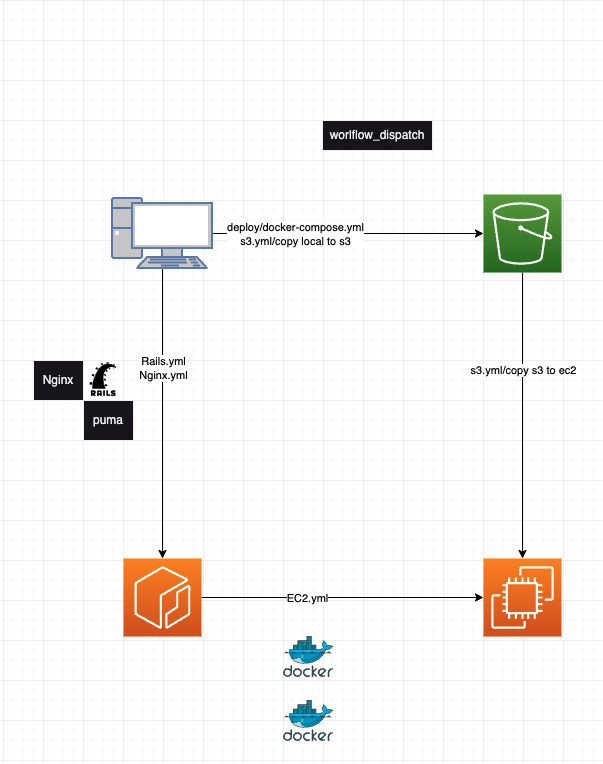

- RailsとNginxを手動でECRに保存

  .github/workflows/Rails.yml : RailsをECRに保存

  .github/workflows/Nginx.yml : NginxをECRに保存

- deploy/にあるdocker-compose.ymlをEC2におくファイル

  .github/workflows/S3.yml name: copy local to s3

- S3に置いたdocker-compose.ymlをEC2にコピー

  .github/workflows/S3.yml name: copy s3 to ec2

- EC2からECRに保存したdockerimageをpull

  .github/workflows/EC2.yml

  主要コマンド pull, migrate:reset, seed:replant, up -d

Railsをpumaで起動、サーバーはnginx。
